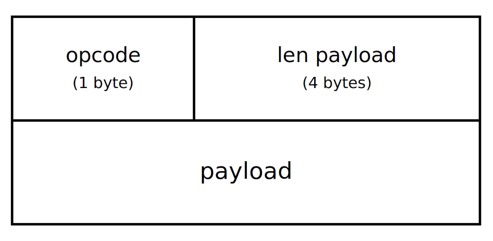
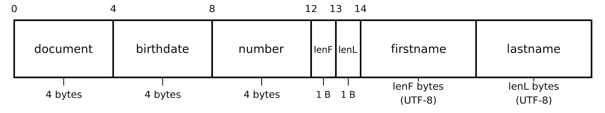
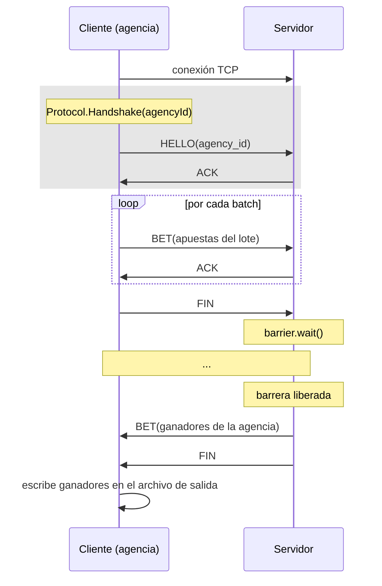

# Informe

Este informe describe el protocolo de comunicación diseñado entre cliente y servidor, y los mecanismos de sincronización utilizados en el servidor para coordinar el acceso concurrente de múltiples agencias.

## 1. Protocolo de comunicación

La comunicación es sobre TCP, con un protocolo de mensajes binario. Se utiliza un protocolo del tipo Request-Reply, donde un cliente envía peticiones al servidor, y recibe una respuesta.

### 1.1 Framing (encabezado común a todo mensaje)

Todo mensaje viaja envuelto en un frame de 5 bytes de encabezado seguido de un payload de longitud variable:

El `opcode` identifica el tipo de mensaje:

| Opcode  | Valor | Dirección           | Payload                              |
|---------|:-----:|----------------------|---------------------------------------|
| `HELLO` |   3   | cliente → servidor    | `agency_id` (1 byte)                  |
| `BET`   |   0   | ambas direcciones     | 0 o más apuestas serializadas (ver 1.2) |
| `ACK`   |   2   | servidor → cliente    | vacío                                  |
| `FIN`   |   1   | ambas direcciones     | vacío                                  |

### 1.2 Serialización de una apuesta (`Bet`) dentro de un paquete `BET`

Un paquete `BET` puede contener **varias** apuestas concatenadas una tras otra (así el cliente puede mandar un lote entero en un solo mensaje). Cada apuesta se serializa así:

- `document` y `number`: enteros sin signo de 32 bits, big-endian.
- `birthdate`: empaquetada como un único entero de 32 bits (`año*10000 + mes*100 + día`), para no depender de parsear strings en el hot path de lectura.
- `lenF` / `lenL`: longitud en bytes de `firstname`/`lastname` (hasta 255 bytes cada uno).

El payload completo de un `BET` es, entonces, la concatenación de N apuestas serializadas de esta forma. No lleva ningún campo adicional de "cantidad", el receptor sigue leyendo apuestas hasta consumir todo el payload indicado en el header, corriendo un `offset` que indica donde comienza cada bet.

Nótese que **el `agency_id` no viaja en cada `BET`**: se establece una única vez al principio de la conexión mediante el paquete `HELLO`, y el servidor lo asocia a esa conexión para todo lo que llegue después.

### 1.3 Diagrama de secuencia

El flujo es el siguiente: al conectarse, el cliente hace el *handshake* (`HELLO` + `ACK`) para identificarse ante el servidor con su `agency_id`. Luego entra en un loop enviando sus apuestas en _batches_ mediante `SendBets`, que internamente envía el _batch_ de apuestas al servidor y espera recibir un `ACK` del servidor, indicando la confirmación del servidor de la recepción del _batch_ y su correcto guardado en disco. Una vez que se enviaron todos los _batches_, se envía un `FIN` indicando que ya terminó.

A partir de ahí el cliente queda esperando una respuesta, mientras que del lado del servidor el proceso que atiende a esa agencia llama a `barrier.wait()` y también queda bloqueado — ninguno de los dos hace nada más hasta que se libera la barrera, es decir, hasta que **todas** las agencias requeridas terminaron de mandar sus apuestas. Una vez liberada, cada proceso lee `storage.csv` completo, filtra los ganadores de su propia agencia y se los envía al cliente en un `BET` seguido de un `FIN`. El cliente al recibir los ganadores, los vuelva a disco, a su archivo de salida correspondiente.

## 2. Mecanismos de sincronización de ejecución concurrente

### 2.1 Un proceso por cliente

El servidor acepta conexiones en un loop principal y, por cada una, lanza un `ClientHandler` en un proceso independiente (`multiprocessing.Process`) que se encarga de atender particularmente a una agencia durante todo su ciclo de vida (recibir `HELLO`, recibir apuestas, esperar el sorteo, mandar ganadores). Se utilizan procesos en lugar de threads para permitir paralelismo real, ya que el GIL de Python no lo permite (solo deja ejecutar código Python en un único hilo a la vez, por más que haya más núcleos disponibles).

### 2.2 Acceso concurrente al almacenamiento (`storage.csv`)

Como todos los procesos escriben apuestas al mismo archivo y, más adelante, todos necesitan leerlo entero para calcular ganadores, el acceso se protege con locks de archivo (`fcntl.flock`):

- **Escritura** (`store_bets`): lock **exclusivo** (`LOCK_EX`). Mientras una agencia está escribiendo su lote, ninguna otra puede escribir ni leer, evitando que se intercalen filas a medio escribir o se lean apuestas inconsistentes.
- **Lectura** (`load_bets`, al calcular ganadores): lock **compartido** (`LOCK_SH`). Varios procesos pueden leer el archivo en simultáneo (todos están calculando sus ganadores más o menos al mismo tiempo, justo después de la barrera), pero ninguno puede leer mientras hay una escritura en curso.

### 2.3 Barrera: esperar a que todas las agencias terminen

Se usa una `multiprocessing.Barrier(agency_min_quorum)`, compartida por todos los procesos hijos, la cual exige un mínimo número de procesos para poder sincronizar en un único punto de la ejecución y continuar a partir de allí. Cada proceso, apenas termina de recibir todas las apuestas de su agencia (`FIN` recibido), llama a `barrier.wait()` y queda bloqueado ahí, esperando a que lleguen los restantes.

Esto es lo que garantiza la propiedad importante del sistema: **ningún proceso calcula ni informa ganadores hasta que la última agencia requerida haya cargado todas sus apuestas.** Sin esta barrera, una agencia que termina rápido podría recibir una lista de ganadores calculada sobre datos incompletos.

Una vez que la cantidad configurada de procesos llegó a la barrera, todos se liberan al mismo tiempo y cada uno procede a leer el archivo completo (ya con todas las apuestas de todas las agencias) y filtrar únicamente las que ganaron **y** pertenecen a su propia agencia.

### 2.4 Apagado ordenado

Cuando el servidor recibe `SIGTERM`, deja de aceptar nuevas conexiones por parte de los clientes y cierra su socket. Para hacer que los procesos hijos se enteren del cierre, el servidor central lleva a cabo dos operaciones:

- Llama a `barrier.abort()`. Aquellos procesos que estaban esperando en la barrera reciben un error y proceden a liberar sus recursos. 
- Propaga la señal de cierre a todos sus procesos hijos activos (`worker.terminate()`). Al final, espera que todos ellos finalicen (`worker.join()`).

Cada proceso hijo entonces, al recibir el aviso del cierre, cierra su socket (lo que envía un aviso al cliente) y finaliza su proceso de forma prolija, haciendo que no queden colgados de manera indefinida.

Por otro lado, si el cliente recibe `SIGTERM`, el proceso cambia bastante en comparación al manejo que se hace en el servidor dado que no tenemos procesos a los que avisarles del cierre. 

Para esto se utiliza una `goroutine` que funciona como un thread común y corriente, el cual va a estar esperando en segundo plano la señal de `SIGTERM`. Cuando llegue, el hilo se ejecuta, y va a cerrar el socket del cliente y a levantar el flag `shutting_down`. Posterior al cierre, en el momento que el cliente quiera ejecutar una operación sobre el socket, va a recibir un error (ya que fue cerrado por la `goroutine`) y para diferenciar un error real de un error por cierre de `SIGTERM`, va a validar contra esa flag. Finalmente, termina el proceso de forma prolija.
